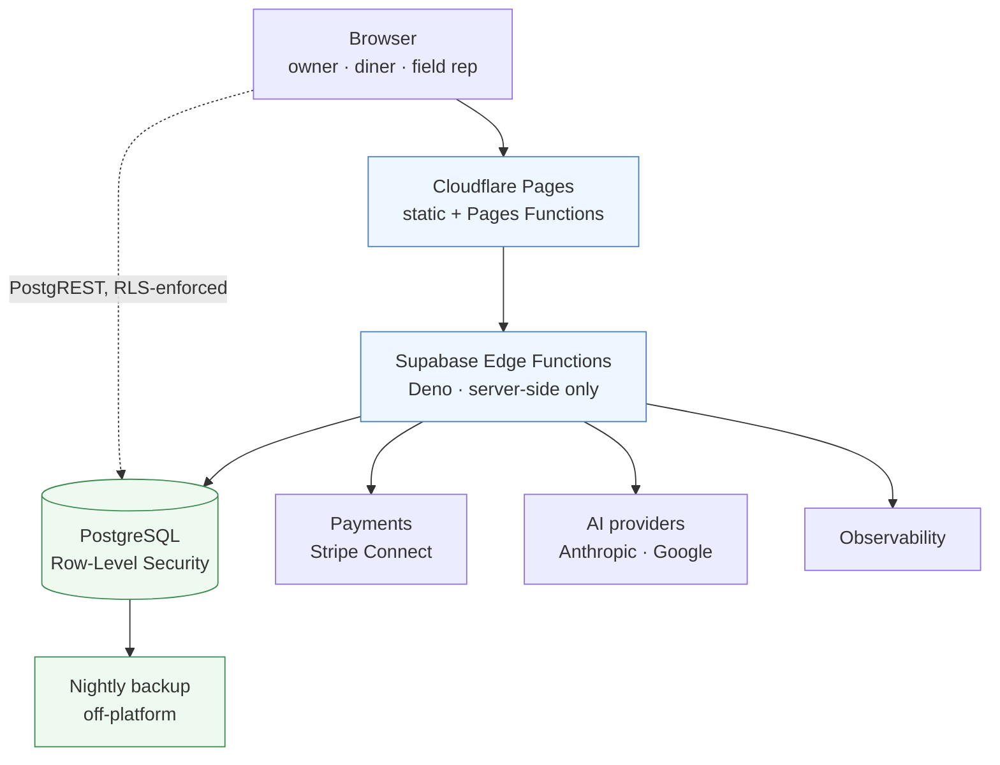
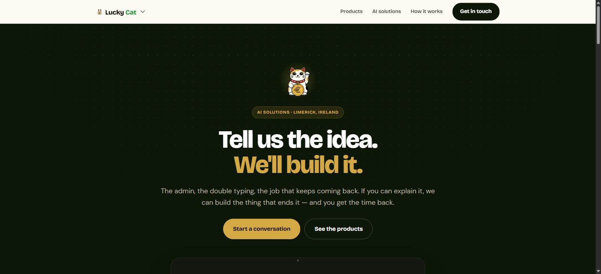
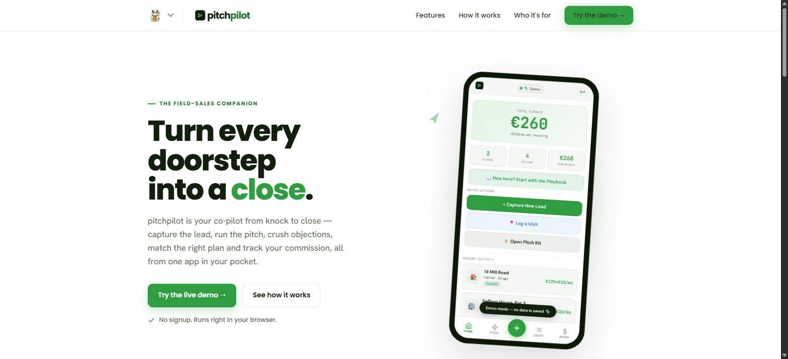
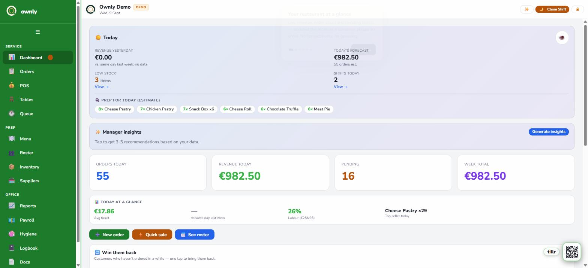
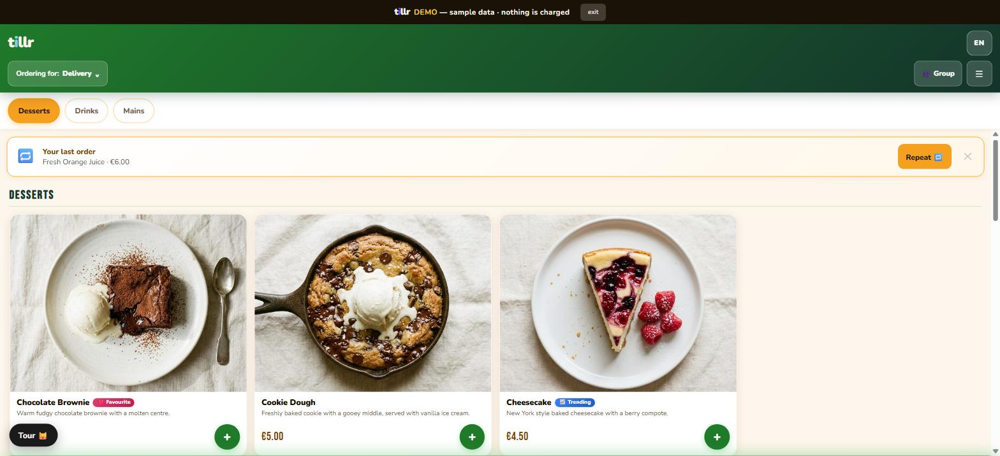

# Lucky Cat AI Solutions — Engineering Case Study

**Augusto Bastos** · Founder & AI Software Engineer · Limerick, Ireland

A multi-tenant SaaS platform for small food businesses, plus two adjacent
products, designed and built solo. This repository explains how it is engineered:
the architecture, where the tenant boundary lives, how the AI surfaces are built
and tested, how releases work, and how I use coding agents on production systems
without letting them near production.

> **The production source is private by design.** This repository is a sanitized
> engineering case study — not a source mirror, not a fork, and not a deployable
> copy. It contains no credentials, no configuration and no customer data.
> [Why](#why-the-source-is-private).

**Live:** [luckycat.ie](https://luckycat.ie) ·
[ownly demo](https://luckycat.ie/demo/ownly) ·
[tillr demo](https://luckycat.ie/demo/tillr) ·
[PitchPilot](https://luckycat.ie/pitchpilot/) ·
[Nock](https://luckycat.ie/nock)

---

## What it is

Four products sharing one engineering system.

| | Who uses it | What it does |
|---|---|---|
| **Ownly** | the business owner | live orders, point of sale, payments, staff, reports |
| **Tillr** | the owner's customers | ordering under the restaurant's own brand — not a marketplace |
| **PitchPilot** | a field sales rep | lead capture, guided pitch, objection handling, commission |
| **Nock** | trades | AI receptionist that answers, qualifies and helps book |

One codebase serves every tenant. A store is a row and a configuration — never a
branch, never a fork.

---

## My role

I am the founder and the engineer. There is no team behind this.

Architecture and data modelling · Postgres and Row-Level Security · Edge
functions · applied AI: retrieval, guards, evals, structured output · payment
integration and reliability · CI/CD and release engineering · incident analysis ·
running the infrastructure · and the product decisions about what not to build.

I am not an ML researcher and this is not a modelling portfolio. The evidence
here is **applied AI systems engineering**: retrieval, boundaries, failure
handling, evaluation and governance around models I did not train.

---

## Architecture

The browser talks to Postgres directly, and that is safe on purpose: Row-Level
Security decides what exists, so there is no application tier that could forget
to filter. Anything holding a secret — model calls, payment intents, webhooks —
runs server-side.

→ [Full architecture](docs/architecture.md)

---

## Engineering highlights

**Tenant isolation is enforced in Postgres, not in the front end.** A missing
application filter fails *open*; a missing policy fails *closed*. Adversarial
cross-tenant tests exist, and they assert that the protected views actually
contain rows — so "zero rows returned" cannot be a false green from an empty
table.
→ [Multi-tenancy and security](docs/multi-tenancy-and-security.md) ·
[RLS pattern](examples/rls-pattern.sql)

**One of the four AI surfaces contains no model call, deliberately.** The daily
briefing is arithmetic over a store's own rows; a language model would add
latency, cost, a provider dependency and a chance of inventing a number the owner
then acts on. Knowing which problems are not model problems is part of the job.
→ [AI engineering](docs/ai-engineering.md)

**Six deterministic guards sit between the model and the user** — structured
output, stale business rules, injection through retrieved content, honest
refusal, tenant isolation in context, and groundedness of numeric claims. Each
has an eval group, and the page is explicit about what those evals do *not*
prove.
→ [Eval cases](examples/eval-cases.json)

**Merging to trunk publishes nothing.** `main` and the production pointer are
separate; a release is an explicit command and rollback is the same operation
reversed. Previews are validated against the exact commit before promotion.
→ [Delivery and reliability](docs/delivery-and-reliability.md)

**Payments are idempotent at the database, not in the handler.** The ledger is
keyed by the payment's own identity, so a webhook redelivery cannot double-count,
and accrual is separated from transfer.
→ [Idempotency pattern](examples/idempotency-pattern.ts)

**I build this with coding agents, and the system is designed so that both humans
and agents can be wrong safely.** Four sanitized incidents show which mechanism
caught what — including two cases where the wrong belief was mine, written into a
pull request description.
→ [Agentic engineering](docs/agentic-engineering.md)

---

## What it looks like

Public surfaces only. Every screen below is a public demo with sample data — no
customer data, no internal dashboard, no operator tooling.

| | |
|---|---|
|  |  |
| **luckycat.ie** | **PitchPilot** — the field-sales copilot |
|  |  |
| **Ownly** — the owner's screen: live orders, POS, roster, reports | **Tillr** — what the owner's customers see, under the restaurant's own brand |

---

## Deep dives

| | |
|---|---|
| [Architecture](docs/architecture.md) | request path, product boundaries, canonical source vs generated output |
| [Multi-tenancy and security](docs/multi-tenancy-and-security.md) | RLS as the boundary, anonymous sessions, `SECURITY DEFINER` review, adversarial tests |
| [AI engineering](docs/ai-engineering.md) | retrieval, guards, evals, failure handling, data governance |
| [Delivery and reliability](docs/delivery-and-reliability.md) | gates, exact-SHA previews, promotion, rollback, alarm calibration |
| [Agentic engineering](docs/agentic-engineering.md) | how agents are scoped, and four incidents that shaped the guardrails |
| [Selected decisions](docs/selected-decisions.md) | six ADRs: decision, alternatives, why, trade-off |
| [Evidence and limitations](docs/evidence-and-limitations.md) | what is proven, and what is explicitly not |

---

## Evidence and limitations

The [evidence page](docs/evidence-and-limitations.md) states both sides. The
short version of the limitations, because it belongs on the first screen:

**There are no paying customers.** No real customer has ordered and none has
paid. The payment rail was exercised end to end in live infrastructure with a
small amount of my own money — that proves the integration, not demand.
Onboarding has never run in production, disaster recovery has never been
exercised, and there are no uptime or scale figures here because I have no
instrumented ones to quote.

---

## Technology

Verified against the repository, not aspirational.

**Languages & runtime** — TypeScript, SQL, Deno, PowerShell
**Front end** — React, Vite, Zustand
**Data** — PostgreSQL, Supabase, Row-Level Security, `pgvector`
**Server-side** — Supabase Edge Functions, Cloudflare Pages Functions
**AI** — Anthropic, Google Gemini, embeddings + retrieval, Langfuse tracing
**Payments** — Stripe Connect
**Delivery** — GitHub Actions, Cloudflare Pages
**Testing** — Playwright, Vitest, Deno test
**Operations** — Sentry, object storage for off-platform backups

No Docker, Kubernetes or Terraform — because none is used. Object storage is used
for exactly one thing: the nightly backup lives off the primary platform.

---

## Why the source is private

The production repository holds proprietary implementation, operational
configuration, internal commercial logic and the engineering history of a live
system serving a real business's data.

Publishing it would expose that without making the engineering any easier to
evaluate — which is what this repository is for. The patterns transfer; the
specifics are not the interesting part, and they are the part that carries risk.

No credential is stored in any repository. Secrets live in the platform providers
and in a password manager, and are read into memory at run time.

I am happy to walk through the private repository in a conversation.

---

## Contact

[luckycat.ie](https://luckycat.ie) ·
[github.com/augbastos](https://github.com/augbastos)
