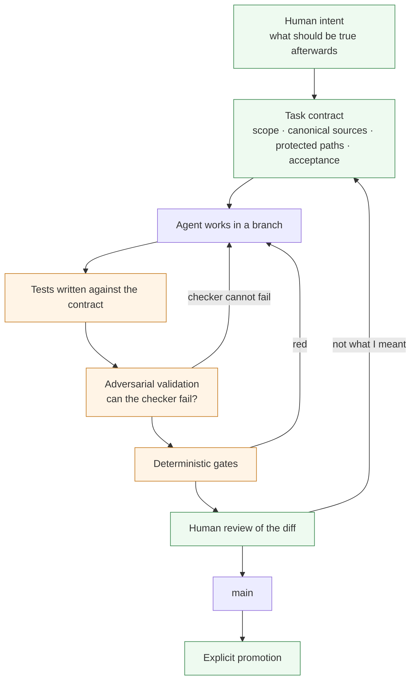

# Agentic engineering

I build this platform with coding agents. Not as an experiment on the side — as
the normal way work gets done, including work that touches money and tenant
isolation.

That is only defensible because of how the surrounding system is built. This page
is about that system.

---

## The shape of the loop

The agent's output is a **proposal**. It becomes a change when deterministic
checks pass and a human reads the diff. Nothing an agent asserts about its own
work is treated as evidence — the tests are the evidence, and the tests are
themselves checked for whether they can fail.

---

## What an agent is given, and what it is denied

**Given:**

- an explicit scope — which files, which outcome, what "done" means;
- canonical sources, named, so it does not have to guess which of three documents
  is current;
- a single command that runs every gate, so it can check itself before asking;
- runnable verification, not a description of verification.

**Denied, by configuration rather than by instruction:**

- frozen paths belonging to a third-party client, enforced as deny rules;
- the production pointer — no agent path leads to a release;
- secrets — a credential is read into a variable and referenced, never printed
  into output, a report, or a commit;
- broad staging: adding everything in the working tree is prohibited, because a
  session that does it once leaks the file nobody meant to commit.

The difference between an instruction and a configuration matters. An instruction
is followed until it is forgotten. A deny rule is not.

---

## Incidents, sanitised

Four real cases. None is interesting because an agent was wrong; each is
interesting because of **which mechanism caught it**.

### 1. A test caught a listener leak in the code it was written for

A UI overlay needed a keyboard dismissal path. The implementation subscribed to a
key event and returned an unsubscribe function — the ordinary pattern.

The test written alongside it asserted that after unsubscribing, the handler no
longer fires. It failed. The subscription used a boolean capture flag, which the
browser normalises identically on both subscribe and unsubscribe, but the
server-side runtime the tests execute in normalises only on subscribe. The
listener leaked. A dismissed overlay would have kept listening and closed the
*next* one — a bug whose symptom appears far from its cause.

**The test was written before the code ran, and it failed on the first
execution.** That is the entire value of writing it first.

### 2. A checker that worked locally and was blind in CI

A gate compared a published sitemap's timestamps against each page's last commit
date. It passed everywhere.

In CI it was reading a shallow checkout, where that history does not exist. The
check did not fail — it found nothing to compare and said nothing. Green, and
measuring zero.

Two fixes, and the second is the important one: give the job the history it
needs, and make the checker **announce that it could not measure**. Silence is
the failure mode that looks most like success.

### 3. An exporter that broke the day the work was finished

A tool exports the state of external platforms into the repository. It had run
for weeks. It broke the moment the last open pull request was merged.

The list of open pull requests became empty, and in that runtime an empty JSON
array parses to a null rather than an empty collection. The next line asked for
its length and threw.

A latent bug that fires only when a list is empty — which here meant *the day the
board is clear*. Fixed at the boundary where external JSON enters, with the
remaining exporters audited for the same shape.

### 4. A gate that was never connected

Three checks were written, wired into the local runner, and described in a pull
request as running in CI. They did not run in CI at all: CI lists its steps
individually and nobody had added them.

Caught by reading the pipeline rather than trusting the sentence I had written
about it. The claim and the reality were reconciled in the same change.

---

## The principle

> **The engineering system is designed so that both humans and agents can be
> wrong safely.**

Every case above is a wrong belief that cost nothing because something
independent of the believer disagreed in time. Two of them were *my* wrong
beliefs, written into a pull request description. The mechanism does not care who
authored the mistake, which is exactly why it works on agents.

The failure modes are the same for both:

| Failure | Human | Agent |
|---|---|---|
| confident and wrong | yes | yes |
| stops at the first plausible answer | yes | yes |
| trusts a stale document | yes | yes |
| claims a test passed without reading it | yes | yes |
| writes a checker that cannot fail | yes | yes |

The countermeasure is not supervision. It is that the important claims are
**executable**: a gate, a test, a preflight, a byte comparison. A checker is not
trusted until it has been observed failing on purpose.

---

## Delegation, and where it stops

Work is delegated to agents when it is bounded, self-contained and testable, and
the returning work is verified before integration — not read and accepted.

One return arrived with a shell escape sequence injected into a source file,
which broke compilation. The test suite still passed, because the tests imported
the library directly and never the page that had been damaged. Running the full
gate — lint, types, build, tests — is what caught it. A passing test suite is
evidence about the tests, not about the build.

Some categories are never delegated: authentication, payments, database policies,
secrets, releases, and anything that speaks publicly on my behalf. Not because an
agent would necessarily fail, but because those are the places where being wrong
is expensive and slow to detect — the exact combination that makes review the
cheaper path.

---

**Next:** [delivery and reliability](delivery-and-reliability.md) ·
[selected decisions](selected-decisions.md) ·
[evidence and limitations](evidence-and-limitations.md)
