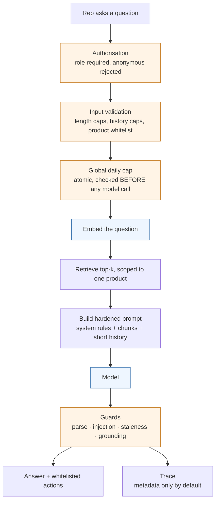

# AI engineering

Four AI surfaces ship in this platform. One of the four contains no model call at
all, and that is the first thing worth explaining.

---

## What actually uses a model, and what deliberately does not

| Surface | Model | Why this shape |
|---|---|---|
| **Business insights** | Anthropic (small, fast model) | turns ~30 days of a store's own operating data into a handful of actionable recommendations. Judgement over messy data — a good fit for a model. |
| **Sales copilot** | Google Gemini + `pgvector` retrieval | answers a rep's natural-language question from a curated knowledge base. Retrieval decides correctness; the model decides phrasing. |
| **Menu translation** | Google Gemini | translates one description into the app's languages. Human-in-the-loop by design. |
| **Daily briefing** | **none** | numbers, comparisons and thresholds. Deterministic SQL. |

The daily briefing is the one I would point at first. It reads like an obvious
candidate for a language model — "summarise yesterday for the owner" — and it is
the wrong tool. The output is arithmetic over the store's own rows. A model would
add latency, cost, a provider dependency, a failure mode, and a non-zero chance
of inventing a number that the owner would then act on.

**Knowing which problems are not model problems is part of AI engineering.** A
system where everything routes through an LLM is not more advanced; it is less
examined.

---

## The retrieval path

Four details in that path are load-bearing.

**The spend cap comes before the model, not after.** It is an atomic counter
checked in the database. Over the cap, the function returns a structured refusal
and never calls the provider. A cost control that runs after the expensive call
is an accounting feature, not a control.

**Retrieval is scoped, and the scope is not a client parameter.** The query
matches only chunks belonging to the product the caller is authorised for. Tenant
isolation in a RAG system has to hold at the retrieval layer, because a prompt
instruction not to mention another tenant's data is not a boundary — it is a
request.

**The key never reaches the browser.** Embedding and generation happen in a
server-side function. This is an authorisation decision as much as a secrets one:
a compromised front end cannot spend the inference budget.

**Structured output is parsed, not trusted.** The model returns prose plus a
fenced JSON block of proposed actions. The block is stripped from the visible
answer, parsed defensively, and every action type is checked against a
whitelist. An action the parser does not recognise is dropped, not executed.

---

## The guards

Six deterministic checks sit between the model and the user. Each is a pure
function, each has an eval group, and each exists because of a specific way this
kind of system goes wrong.

| Guard | Catches |
|---|---|
| **structured output** | prose wrapped around JSON, fences, trailing commas, truncation — the parser must not throw on a malformed response |
| **stale business rule** | the knowledge base contains superseded policy; the answer must not repeat a retired commercial claim |
| **injection** | instructions embedded *in retrieved content* trying to redirect the model |
| **honest refusal** | recognising "I don't know" as a correct answer, so a refusal is not scored as a failure |
| **tenant isolation** | any retrieved chunk not belonging to the caller's scope |
| **groundedness** | numbers in the answer that appear in no retrieved chunk |

The groundedness guard is an honest approximation and is documented as one. It
extracts numeric claims and checks whether each appears in the retrieved context.
It cannot judge whether a sentence is *true*; it can catch a figure the model
produced from nowhere, which is the failure that costs a business owner money.

Writing it surfaced a real bug in the guard itself. The number pattern was
initially loose enough to swallow the full stop at the end of a sentence, which
changed what counted as a claim. The eval caught it. **A guard is code and gets
the same suspicion as any other code.**

---

## What the evals prove, and what they do not

This distinction matters more than the eval count.

**Proven:**

- each guard behaves as specified across its case set;
- the parser survives malformed and adversarial model output;
- known regressions stay fixed — a case is added when a failure is found;
- the dataset cannot be quietly emptied: a minimum count per group is asserted,
  so deleting cases to make the suite pass fails the suite.

**Not proven, and stated as such:**

- the semantic quality of any given live model response;
- that a future model version behaves like the current one;
- that retrieval returns the *best* chunk rather than a sufficient one;
- any business outcome.

Deterministic evals over guards and parsers are cheap, fast and run on every
push. Semantic quality evaluation is a different instrument with a different
cost, and claiming the first proves the second would be the most common
overstatement in this field.

Representative public cases:
[`examples/eval-cases.json`](../examples/eval-cases.json).

---

## Failure, observability and data governance

**Providers fail, and the product does not.** A missing provider key returns a
structured, explanatory response with a success status rather than a 500 — the
owner sees "this needs configuring", not a broken screen. A failed model call
degrades to an unavailable state; it never writes partial output.

**Two of the three surfaces never write to the database at all.** Insights are
read-only. Translation fills fields the owner then reviews and saves through the
normal validated path — the model proposes, a human commits. That is not
timidity; it is where the review belongs when the output is customer-facing text
in four languages.

**Tracing captures metadata by default.** Function, model, tenant identifier,
token counts, latency, error. Prompt and completion content is behind an explicit
flag and off in production, because that content carries a business's own data.
The observability vendor is a data processor the moment that flag flips, and
treating that as a configuration detail rather than a governance decision is how
a privacy problem gets shipped by accident.

---

**Next:** [multi-tenancy and security](multi-tenancy-and-security.md) ·
[agentic engineering](agentic-engineering.md) ·
[evidence and limitations](evidence-and-limitations.md)
