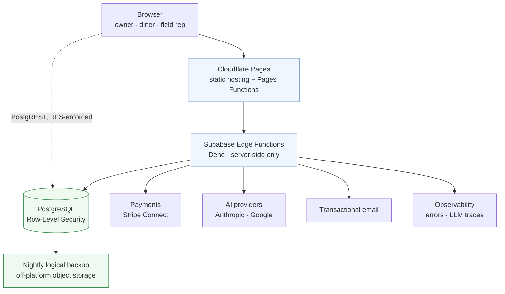
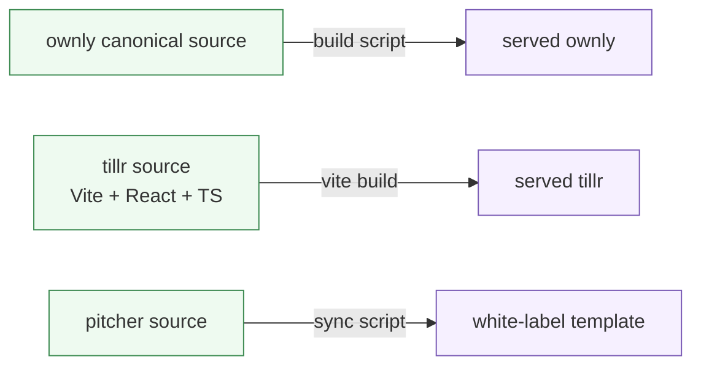

# Architecture

Lucky Cat is a multi-tenant SaaS platform for small food businesses, plus two
adjacent products that share its engineering. One codebase serves every tenant.
A store is a row and a configuration — never a branch, never a fork.

This page explains the shape of the system and the reasoning behind the
boundaries. It does not contain deployment configuration, identifiers or
endpoints.

---

## The request path

Two things in that diagram carry most of the design.

**The browser talks to Postgres directly, and that is safe on purpose.** Reads
and writes go through PostgREST with the caller's own JWT, and Row-Level Security
decides what exists. There is no application tier deciding who sees what, because
an application tier that decides authorisation is an application tier that can
forget to. See [multi-tenancy and security](multi-tenancy-and-security.md).

**Anything holding a secret runs server-side.** Model calls, payment
intents and webhook handling live in Edge Functions. A provider key never reaches
a browser, which also means a compromised front end cannot spend money on
inference.

---

## Products, and why they share a repository

| Product | Who uses it | What it is |
|---|---|---|
| **Ownly** | the business owner | live orders, point of sale, payments, staff, reports |
| **Tillr** | the owner's customers | ordering app under the restaurant's own brand |
| **PitchPilot** | a field sales rep | lead capture, guided pitch, objection handling, commission |
| **Nock** | trades — plumbers, electricians | AI receptionist that answers, qualifies and helps book |

Ownly and Tillr are one product from the database's point of view. A diner places
an order in Tillr; it appears on the owner's screen in Ownly a moment later. They
share tables, policies, money paths, realtime channels and deployment. Splitting
them across repositories would mean a schema change lands in two places, in two
pull requests, with a window in between where the two disagree.

**The boundary follows what changes together, not what is sold separately.**
PitchPilot ships from the same repository because it reads the same commercial
knowledge base. Nock does not: it is a different domain, a different customer,
and nothing in it changes when a menu item does.

---

## Canonical source and generated output

Some directories are written by a person and some are written by a build. Serving
one while editing the other is the kind of mistake that costs an afternoon,
because the symptom is "my change did nothing".

The rule is one-way and enforced rather than remembered: a CI gate compares each
canonical/served pair byte for byte and fails on drift. A machine-readable map
classifies every top-level directory — active source, generated, historical,
frozen — and a second gate fails when that map stops matching the tree.

That map exists because directory names lie. In this repository, more than one
folder whose name sounds like live infrastructure is a retired backend nobody has
removed yet, and at least one that looks dead cannot be moved because a frozen
client's configuration resolves a path through it. Names are not evidence.

---

## Data model shape

Every tenant-scoped table carries a store identifier, and every policy on those
tables resolves membership rather than trusting the caller.

Money is deliberately boring:

- prices and totals are computed server-side, never accepted from the client;
- a payment produces a ledger row keyed by the payment intent's own identifier,
  so a webhook redelivery cannot double-count;
- accrual and transfer are separate concerns with separate records.

The retrieval layer for the sales copilot uses `pgvector`, with embeddings
scoped to a product so a query cannot retrieve another product's knowledge.

---

## What is not here

No infrastructure-as-code, no Kubernetes, no service mesh. The platform is
Cloudflare Pages plus Supabase, and the honest reason is that a solo engineer
serving small businesses gets more from Row-Level Security correctness and a
reliable release path than from orchestration.

Object storage is used for one thing: the nightly database backup lives off the
primary platform, so a failure of the database provider does not take the only
copy with it.

---

**Next:** [multi-tenancy and security](multi-tenancy-and-security.md) ·
[AI engineering](ai-engineering.md) ·
[delivery and reliability](delivery-and-reliability.md)
