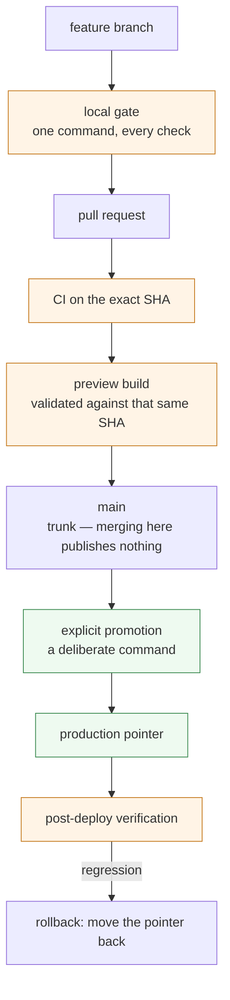

# Delivery and reliability

How a change gets from a branch to the internet, and what has to be true at each
step before it moves.

---

## The pipeline



---

## Merging to trunk does not publish

This is the part I would most want a reviewer to notice, because it is a change I
made after living with the alternative.

**Before:** the trunk branch *was* the production branch. Merging a pull request
published it. That is convenient and it conflates two decisions — "this change is
good" and "this change should be live right now" — into one click.

**Now:** `main` is the trunk. Everything lands there and nothing ships.
`production` is a pointer to what is actually serving, and it moves only when a
specific script moves it.

The benefit is not ceremony. It is that trunk and production can differ *on
purpose*: a documentation fix, a test, a gate can all land in `main` without
touching what a customer sees, and a release becomes a decision with a timestamp
rather than a side effect of a merge.

Rollback falls out of the same design. Moving the pointer back is the same
operation as moving it forward.

---

## The gates

One command runs every deterministic check locally, and the same checks run in
CI. The list is not decoration — each one exists because something got through
once:

- unit tests for server-side functions;
- deterministic AI guard evals;
- a check that a hardcoded commercial rate cannot appear outside one module;
- pricing consistency across every live surface that quotes a number;
- accessibility contrast and accessible-name checks;
- SEO coherence — sitemap, robots and page metadata agreeing with each other;
- sub-processor coverage: the vendors named in the data-processing agreement
  against the external hosts the code actually contacts;
- drift between canonical sources and their generated output, byte for byte;
- a repository map that must keep matching the tree;
- cross-tenant isolation tests.

### SKIP is not PASS

The runner distinguishes three outcomes, and prints the third loudly:

```
16 PASS   1 SKIP   0 FAIL
SKIP is not PASS — these steps were NOT measured:
  - cross-tenant isolation: no credential (SUPABASE_URL, SERVICE_ROLE_KEY)
```

A step that could not run is never rendered as success. A developer machine has
no business holding a service-role key, so skipping there is correct; inside CI
the same absence is a configuration defect and fails.

### A gate that only runs locally is not a gate

Three checks were written, wired into the local runner, and described in a pull
request as "running in CI". They were not. CI does not invoke the local runner —
it lists its steps individually, and nobody had added them.

They now run in CI, with the checkout depth the history-dependent one needs, and
that checker announces when it *cannot* measure rather than passing quietly. The
claim was corrected in the same change that made it true.

---

## Validating the exact SHA

A preview that does not correspond to the commit about to ship is not evidence.

The hosted branch preview has an intermittent failure mode where the deployment
is created, reports a healthy status, and serves nothing — every route returns a
not-found page. It is not always visible from the deployment list.

The workaround is deterministic: build the exact tree locally and upload it as a
preview under a name derived from the commit. Content assertions then run against
a preview that provably corresponds to the commit under review — the specific
changes are asserted present, and the pages that must not regress are asserted
still working.

For the release described in the evidence page, that meant 19 content assertions
on the preview and an end-to-end browser suite run twice: once against the
preview, once against production as a baseline. Comparing the two is what turns
"two tests failed" into "the same test fails on production today, so this is not
a regression".

---

## Migrations are not coupled to deploys by default

Schema changes live outside the directory any tool globs, until someone
deliberately moves one in. Each carries its rollback, a **preflight** that fails
if production has drifted from what the file assumed, and a **verify** that fails
with the exact unmet post-condition.

Both were shown to fail before being trusted. The verify script correctly reports
failure while the migrations are unapplied, and an inverted probe against the
preflight raised as expected. A checker nobody has seen go red is not evidence of
anything.

The default is that a release ships no schema change. Coupling is opt-in, per
migration, with a reason.

---

## Knowing something died

Detection was inventoried per subsystem, and the honest finding was not "we need
more alarms".

Two alarms had been firing, unread, for weeks. One of them was **wrong 18 times
in 27 days**: the nightly backup had never failed. What had failed was an
*optional* secondary copy, and the script treated any replica failure as a lost
backup — so it reported catastrophe while the off-platform copy was verifiably in
place.

The fix was to make severity proportional to what was actually lost. An optional
target being unavailable is a warning. A failed off-platform copy stays an error,
because that is the only copy outside the primary platform. And the failure
message now names which of the two happened, instead of always claiming the
worse one.

**An alarm that has cried wolf 18 times is an alarm nobody believes on the day it
is right.** Calibration is not a smaller problem than coverage.

A second finding from the same review: four scheduled jobs dispatch asynchronous
HTTP and the scheduler records success the moment the request is *queued* — before
it happens. In one retained window, 7 of 36 dispatches never got a response and
all 36 were recorded as successful. "Zero failures" from that source is not a
health signal, and the payout job uses the same pattern.

---

**Next:** [agentic engineering](agentic-engineering.md) ·
[selected decisions](selected-decisions.md) ·
[evidence and limitations](evidence-and-limitations.md)
